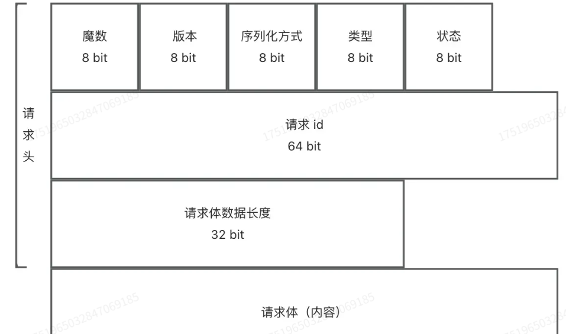

# 项目介绍
1.简易化的rpc框架开发
2.扩展板的rpc框架开发

# 项目架构
- vertx实现服务端

# 开发阶段
## 2025-5.21
- 简易版RPC开发
- 功能包括
  - 服务注册  
  - 服务发现
  - 序列化器
  - vertx服务端
## 2025-5.22
- 扩展功能-全局配置
  - 常见配置：
    - 注册中心地址
    - 服务接口
    - 序列化方式
    - 网络通信协议
    - 超时设置
    - 负载均衡策略
    - 服务端线程模型
## 2025-5.23
-  扩展功能-MOCK+SPI机制+多序列化器
  -  常用Json
    - jdk
    - kryo
    - hessian
    - json
## 2025-5.25-
- 扩展功能-注册中心
  - 核心能力
    - 服务注册:服务提供者上报到注册中心
    - 服务发现:服务消费者从注册中心获取服务提供者信息
    - 心跳检测:定期检测服务提供者的存活状态
    - 服务注销:手动剔除节点
  - 技术选型
    - Etcd
    - Zookeeper
    - Redis
## 2025-5.29-
- 扩展功能-注册中心优化
  - 优化点
    - 1.心跳检测和续期机制
      - 方案设计:
        - Etcd实现心跳检测:如果ETCD的key到指定时间不续期,就是节点寄了
        - 实现步骤:
          - 1.服务提供者向ETcd注册自己的服务信息,并在注册时设置TTL(生存时间)
          - 2.Etcd在接受服务提供者的注册信息后，会自动维护服务信息的TTL,并在TTL过期的时候删除该服务信息
          - 3.服务提供者定期请求Etcd续约自己的注册信息,重写TTL
    - 2.服务节点下线机制
    - 3.消费端服务缓存
    - 4.基于Zookeeper实现
## 2025-5.31-
- 扩展功能-自定义协议
  - 设计方案
    - 网络传输设计
      - 避免http头信息大,采用tcp
    - 消息结构体设计
      - 使用最少的空间
      - 消息体消息设计
        - 1.魔数
        - 2.版本号
        - 3.序列化方式
        - 4.类型
        - 5.状态
        
    - 解决粘包和半包问题
      - 核心思路:在消息头中设置请求体的长度,服务端接收时，判断每次消息的长度是否符合预期,不完整就不读，留到下次再读取。
      - 使用Vertx解决：
        - 使用RecordParser:保证下次读取到特定长度的字符
## 2025-6.7-
- 扩展功能-负载均衡
  - 设计方案
    - 常见的负载均衡算法
      - 1.轮询:按照顺序将请求分配给每个服务器:1 2 3 4 5 1 2 3 4 5
      - 2.随机:随机选择一个服务器:3 2 4 1 4 5 1 2 4 
      - 3.加权轮询:根据服务器的性能和配置，给每个服务器分配不同的权重:1 1 1 2 1 1 1 3 1 1 1 4
      - 4.加权随机:根据服务器的性能和配置，给每个服务器分配不同的权重，然后随机选择一个服务器:3 2 4 1 4 5 1 2 4
      - 5.最小连接数:选择当前连接数最少的服务器:适用于长连接场景
      - 6.IP哈希:根据客户端的IP地址进行哈希，然后选择对应的服务器:适用于有状态的服务
    - 一致性Hash
      - 请求分配到多个节点或服务器上:将整个哈希空间划分成环状结构，每个节点或服务器环上占据位置,每个请求根据其哈希值映射到环的点然后顺时针寻找第一个大于或等于该哈希值的节点上
## 2025-6.8-
- 扩展功能-重试机制
  - 设计方案
    - 重试条件
      - 1.网络异常
    - 重试时间
      - 1.固定时间
      - 2.指数退避重试:在每次失败后，重试时间间隔会以指数级增加
      - 3.随机延迟重试
      - 4.可变延迟重试
    - 停止重试
      - 1.最大尝试次数:一般重试当到达最大次数不再重试
      - 2.超时停止:重试达到最大时间，停止重试
    - 重试工作
      - 1.通知告紧
      - 2.降级容错
## 2025-6.8-
- 扩展功能-容错机制
  - 设计方案:
    - 1.先容错再重试
    - 2.先重试再容错  
    - 容错策略:
      - 1.Fail-Over:故障转移: 一次调用失败后,切换一个其他节点
      - 2.Fail-Back:失败自动恢复:系统某个功能出现失败调用,通过其他方法恢复该功能的正常---降级
      - 3.Fail-Safe:静默处理:直接忽略掉,不做任何处理
      - 4.Fail-Fast:快速失败:立刻报错,交给外层调用处理方法
    - 容错实现方式:
      - 1.重试: 系统错误后再试一次
      - 2.限流: 系统压力过大，限制操作的数量或频率
      - 3.降级: 系统压力过大，该为执行其他操作。兜底操作
      - 4.熔断: 系统压力过大，直接拒绝请求，防止雪崩效应
      - 5.超时控制: 系统压力过大，限制操作的时间
## 2025-6.9-
- 扩展功能-启动机制和注解驱动